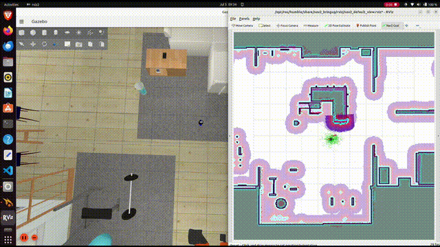
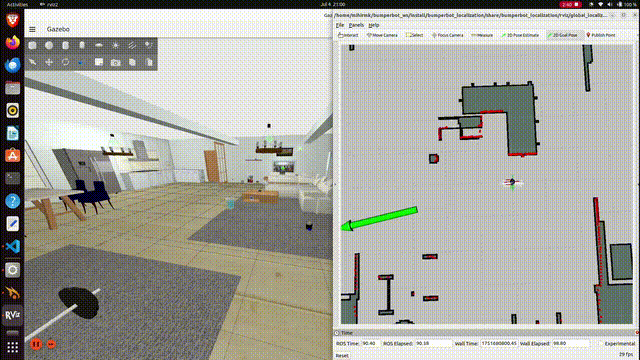

# NavLearn: Autonomous Navigation Stack for Real & Simulated Robots


NavLearn is a modular ROS2-based project built for learning and experimenting with autonomous mobile robot navigation, both in Gazebo simulation and real hardware. This stack includes SLAM, localization, path planning, and navigation with future extensions for reinforcement learning and multi-robot systems.

---

## 📸 Project Highlights


---

## 🎯 Features

* 🗺️ **SLAM with Lidar**: Real-time mapping of unknown environments
* 📍 **Localization**: AMCL-based probabilistic localization
* 🧭 **Navigation**: Nav2 stack integration with obstacle avoidance
* 🧪 **Gazebo Simulation**: Full support for testing in simulation
* 🤖 **Real Robot Ready**: Deployed on differential drive robot with calibrated control
* 🔜 **Upcoming**: RL-based planning, multi-agent exploration

---

## 🎥 Demos

### 📡 SLAM Mapping Demo

> Demonstrates full mapping in an indoor environment.

<p align="center">
  
</p>

---

### 🚧 Navigation with Static and Dynamic Obstacles

> Shows side-by-side RViz and Gazebo with real-time path replanning.

<p align="center">
  
</p>

---

### 🧭 Navigation Snapshot

> Local and global costmaps with AMCL localization


---

### 🧪 Gazebo Simulation

> Simulated robot running the full navigation stack

<p align="center">
  
</p>

---

### 🧱 TF Tree

> Frame visualization after `bumperbot_bringup`


---

## 🚀  Quick Start

### Clone & Build

```bash
# 1) create a workspace & clone the repo
mkdir -p ~/navlearn_ws/src && cd ~/navlearn_ws/src
git clone https://github.com/MihirMK17/navlearn.git
cd ~/navlearn_ws

# 2) resolve deps & build
rosdep install --from-paths src --ignore-src -y
colcon build
source install/setup.bash
```

### Simulation (Gazebo)
```bash
ros2 launch navlearn_bringup simulated_robot.launch.py world_name:=small_house use_slam:false
```

### Real Robot
```bash
ros2 launch navlearn_bringup real_robot.launch.py world_name:=small_house use_slam:false
```

---

## 📚 Project Documentation

### ✅ Completed

* [x] Real-world SLAM & Navigation setup
* [x] Simulation setup & ROS2 bridge
* [x] Teleop + autonomous navigation
* [x] CI workflow for ROS2 Humble

### 🐞 Common Issues & Fixes

**1. L298N H-Bridge Partial Failure**
Only one motor would work in forward motion due to a damaged internal transistor. Diagnosis was done using joystick teleop commands.

**Fix:** Switched to a reliable driver (e.g., TB6612FNG), added flyback protection, improved ventilation, and verified stall current specs.

**2. HRB 3S Battery Power Drop**
Old battery dropped to 5.04V leading to inconsistent motor behavior and RPi brownout.

**Fix:** Replaced with a rechargeable 3S G-Tech 5000mAh LiPo, ensuring consistent voltage and capacity.

**3. TF Tree Frame Drops / Misalignment**
During SLAM and Navigation, unexpected frame loss occurred.

**Fix:** Verified static\_transform\_publisher configurations, frame\_id consistency in URDF, and launched the correct state\_publisher order.

More fixes and logs documented in [`Project Documentation`](Project%20Documentation.docx)

---

## 🚀 Coming Soon

* ✅ Calibration of wheel base and motor gains
* 🧠 Reinforcement Learning for local planning
* 🤖 Multi-agent navigation support
* ☁️ Edge-cloud updates for policy deployment

---

## 👤 Author

* Mihir Kulkarni
* [LinkedIn](https://www.linkedin.com/in/mihirmk/)
* [mihir.kulkarni17@gmail.com](mailto:mihir.kulkarni17@gmail.com)

---

## 📜 License

This project is based on open-source work by Antonio Brandi ([BumperBot](https://github.com/AntoBrandi/Bumper-Bot)) under Apache 2.0 License.
All modifications and extensions in NavLearn are released under the same license.

---

> 🚧 Built for learning. Made for real-world autonomy.

---


