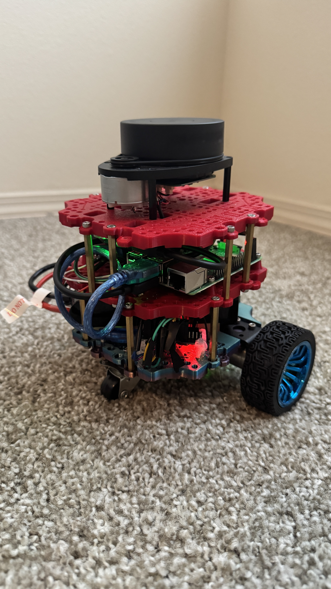
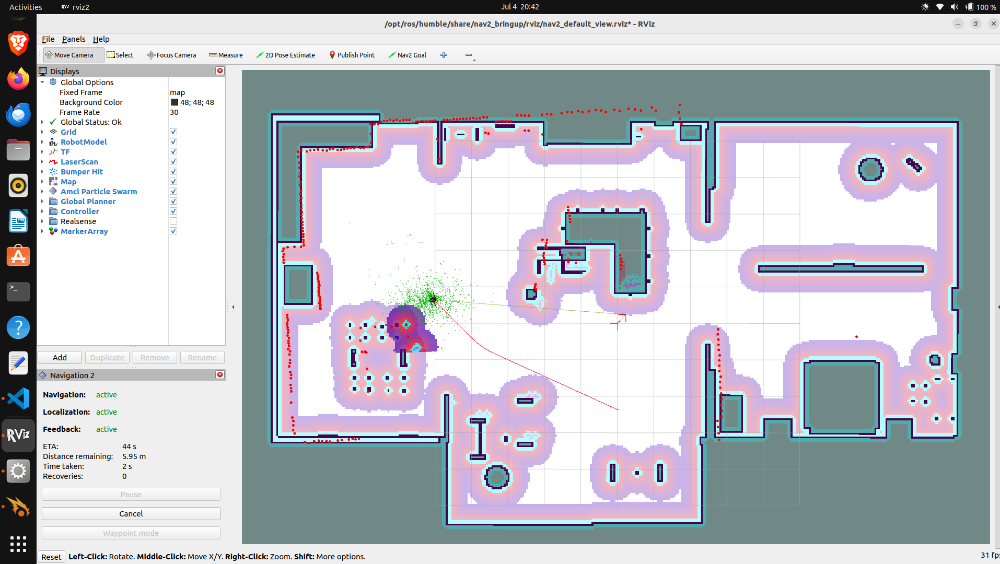
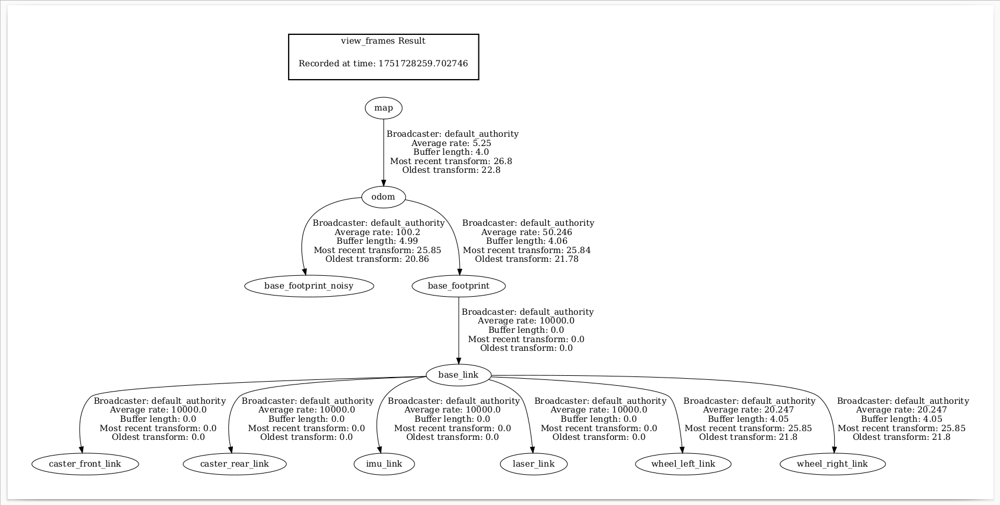

# NavLearn

## Introduction

NavLearn is an open-source ROS 2 Humble mobile robot stack that **combines SLAM, autonomous navigation, simulation, and real-world integration**. It provides a complete solution for mapping environments, planning paths, and controlling a mobile robot both in Gazebo simulation and on real hardware. The project also demonstrates best practices in configuring the ROS 2 Navigation (Nav2) stack for a custom robot.



All core components are included out of the box: **SLAM** mapping (using SLAM Toolbox), **autonomous navigation** (Nav2 for path planning and control), a custom **Gazebo simulation** environment, and a reference **real-world robot** setup (Raspberry Pi 4 with an Arduino motor controller). You can easily switch between simulation and a physical robot while using the same ROS 2 nodes and configurations. NavLearn is ideal as a learning platform or starting point for robotic navigation projects on a budget, and it is actively maintained with new features on the way.

> **Note:** NavLearn is under active development. We are currently working on documentation for common pitfalls and fixes, so expect updates to the docs soon!

## Key Features

NavLearn comes with a rich set of features out of the box:

| **Feature**                   | **Description**                                                                                                                                                                                                                                                                  |
| ----------------------------- | -------------------------------------------------------------------------------------------------------------------------------------------------------------------------------------------------------------------------------------------------------------------------------- |
| **2D SLAM with SLAM Toolbox** | Real-time 2D mapping and localization using [SLAM Toolbox](https://github.com/SteveMacenski/slam_toolbox). The robot can create an occupancy grid map of its environment and localize on the fly.                                                                                |
| **Navigation2 (Nav2) Stack**  | Fully integrated [Nav2](https://navigation.ros.org) stack for autonomous navigation. Includes global path planning, local trajectory control (DWB controller), obstacle avoidance, and recovery behaviors.                                                                       |
| **Gazebo Simulation**         | A high-fidelity Gazebo simulation environment with the robot's URDF model and sensors (e.g. LiDAR). This allows safe testing of SLAM and navigation algorithms in a virtual world before trying on the real robot.                                                               |
| **Real Robot Support**        | Supports deployment on a physical differential-drive robot powered by a Raspberry Pi 4. Uses an Arduino for motor control (with [ROS 2 Control](https://control.ros.org) integration) and standard sensors (wheel encoders, IMU, LiDAR) for odometry and environment perception. |
| **ROS 2 Modular Design**      | Organized into multiple ROS 2 packages (URDF description, bringup launch, control, SLAM, navigation, etc.), making it easy to understand and extend. Launch files are provided to start the whole system with one command.                                                       |
| **Visualization & Tools**     | Includes RViz configurations for visualizing the robot, map, and sensor data. Provides tools for teleoperation and map saving, plus extensive logging to help debug and tune the system.                                                                                         |

*Example: NavLearn mapping an environment using SLAM Toolbox (the occupancy grid is built live during exploration):*

<video src="media/slam_mapping.mp4" controls width="800">
  Your browser does not support the video tag.
</video>

## Quick Start

Follow these instructions to set up the NavLearn project and run it either in simulation or on a real robot.

### Prerequisites

* **ROS 2 Humble** installed on Ubuntu 22.04 (Linux). (The code may also work on newer ROS 2 distributions.)
* **Gazebo** simulator installed (e.g. Gazebo Fortress or later) for running the simulations.
* A **Raspberry Pi 4** with Ubuntu 22.04 + ROS 2 (for the real robot deployment), and an **Arduino** microcontroller for motor control.
* Basic ROS 2 build tools: `rosdep`, `colcon`, etc. (These are included in a standard ROS 2 installation.)

### Installation and Setup

1. **Create a ROS 2 workspace** (if you don't have one yet):

   ```bash
   mkdir -p ~/navlearn_ws/src
   cd ~/navlearn_ws/src
   ```
2. **Clone this repository** into the `src` folder:

   ```bash
   git clone https://github.com/yourusername/navlearn.git
   ```
3. **Install dependencies** using rosdep to automatically fetch required packages (Nav2, SLAM Toolbox, etc.):

   ```bash
   cd ~/navlearn_ws
   rosdep install -i --from-paths src --ignore-src -y
   ```
4. **Build the workspace** with colcon:

   ```bash
   colcon build
   ```
5. **Source the workspace** (do this in every new terminal where you want to use NavLearn):

   ```bash
   source ~/navlearn_ws/install/setup.bash
   ```

### Running in Simulation (Gazebo)

After completing the setup above, you can launch the Gazebo simulation *and* the navigation stack with a single command:

```bash
ros2 launch navlearn_bringup simulated_robot.launch.py
```

This will:

* Spawn the robot in a Gazebo world (with a basic environment).
* Start SLAM Toolbox for mapping the environment (or AMCL for localization if you configure a pre-made map).
* Launch the Nav2 stack (planner, controller, behavior server, etc.) along with RViz for visualization.

Once Gazebo and RViz are running, you can drive the robot around using teleoperation or set navigation goals in RViz. The robot will explore and build a map of the environment using SLAM, then plan and follow paths to reach the goals you set.

*Simulation Demo:* The video below shows the NavLearn robot navigating in the Gazebo simulation:

<video src="media/gazebo_demo.mp4" controls width="800">
  Your browser does not support the video tag.
</video>

### Running on a Real Robot

To run NavLearn on a real robot, make sure you have the appropriate hardware assembled:

* A differential-drive mobile base with motors and wheel encoders.
* A 2D Lidar (or depth camera) for environment sensing.
* A Raspberry Pi 4 running Ubuntu 22.04 + ROS 2, connected to the robot's sensors and actuators.
* An Arduino microcontroller (e.g. Arduino Uno/Nano) connected to the RPi via USB, used for low-level motor control (and reading encoders).

**Hardware setup steps:**

1. **Flash the Arduino** with the provided motor control firmware (see `firmware/robot_control.ino` in this repo). This Arduino code listens for velocity commands and drives the motors, and it publishes wheel encoder ticks for odometry.
2. **Connect everything:** Attach the Arduino to the Raspberry Pi (USB), connect motor drivers and encoders to the Arduino, and plug in the Lidar sensor to the RPi (typically via USB). Ensure all devices are powered and recognized by the RPi (check `/dev/ttyUSB*` for the Arduino connection, etc.).

**Launch the stack on the robot:**

On the Raspberry Pi (or a remote PC networked to the robot), run the real robot launch file:

```bash
ros2 launch navlearn_bringup real_robot.launch.py
```

This will start all the necessary ROS 2 nodes on the robot:

* The hardware interface and controller for driving the motors (using ros2\_control with the Arduino).
* SLAM Toolbox (for mapping mode) or AMCL (for localization mode) to provide the robot's pose on the map.
* The Nav2 navigation nodes (global planner, local planner/controller, costmaps, and behavior server).
* Sensor drivers for the Lidar (and IMU, if present), and TF broadcasters for all frames.

Once launched, you should see the robot's sensor data in RViz and can send navigation goals (via RViz or a ROS 2 action call). The robot will begin moving autonomously to reach the goal while avoiding obstacles. Always be prepared to intervene or hit an emergency stop when running on real hardware, especially in testing phases.

*Real Robot Demo:* Below is a short demo of NavLearn running on a real robot, performing autonomous navigation in a simple environment:

<video src="media/nav_demo.mp4" controls width="800">
  Your browser does not support the video tag.
</video>

## System Architecture

The diagram below provides an overview of NavLearn's system architecture, showing how key ROS 2 nodes and topics are connected:



In this architecture, SLAM Toolbox (or the AMCL localization node) computes the robot's position on the map, maintaining the transform between the **map** and **odom** frames. The **Nav2** stack (planner, controller, and behavior tree nodes) handles path planning and control: it takes in the target goal, uses the global costmap to plan a path, and then uses the local costmap and controller to command velocities to the robot. The robot's **base controller** (a ros2\_control hardware interface) receives those velocity commands and drives the motors via the Arduino. Sensor drivers (e.g. for the LiDAR and IMU) feed data into the SLAM/localization and obstacle avoidance components. All of these nodes are launched together by a single bringup launch file for convenience.

The TF frame hierarchy of the system is illustrated below:



Here, `map` is the global reference frame for navigation, and `odom` is the odometry frame that drifts over time. The robot base is represented by the `base_link` frame. The LiDAR and other sensors publish data in their own frames (e.g. a `laser_frame`) which are static or dynamic transforms attached to `base_link`. NavLearn ensures that all coordinate frames (from sensors up to map) are properly connected, so that the planners and controllers can transform data between frames as needed for navigation.

## Roadmap

We have ambitious plans to extend NavLearn with more advanced capabilities. Some upcoming features on our roadmap include:

* **RL-based Local Planner:** Develop a learning-based local planner using reinforcement learning to improve dynamic obstacle avoidance and path tracking.
* **Multi-Robot Fleet Coordination:** Enable multiple NavLearn robots to share maps and goals, coordinating their movements for collaborative exploration and task completion.
* **Isaac Sim Integration:** Integrate with NVIDIA Isaac Sim for high-fidelity simulation and training, allowing us to develop and test navigation algorithms in photorealistic virtual environments.
* **Dockerized Setup:** Provide a Docker container for NavLearn to simplify installation and ensure a consistent environment (useful for testing and CI).
* **Expanded Documentation:** *In progress.* We're working on comprehensive guides and troubleshooting documentation (covering common mistakes, tuning tips, etc.) to help users get the most out of NavLearn.

Feel free to suggest other ideas or enhancements by opening an issue or pull request. Community feedback is welcome!

## Credits & License

NavLearn builds upon the excellent open-source [Bumper-Bot](https://github.com/AntoBrandi/Bumper-Bot) project created by Antonio Brandi. We thank the original author for providing a strong foundation (Bumper-Bot was released under the Apache 2.0 License).

This project is released under the **Apache 2.0 License**, which means you are free to use, modify, and distribute the code. See the [LICENSE](LICENSE) file for details.

**Credits:** The NavLearn robot design and code draw inspiration from Bumper-Bot and TurtleBot3. All software dependencies (Nav2, SLAM Toolbox, etc.) are open source.
**Contributions:** If you find NavLearn useful or have improvements in mind, please feel free to star this repository, report issues, or contribute via pull requests!

