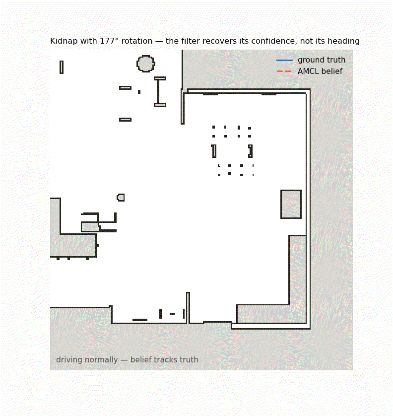
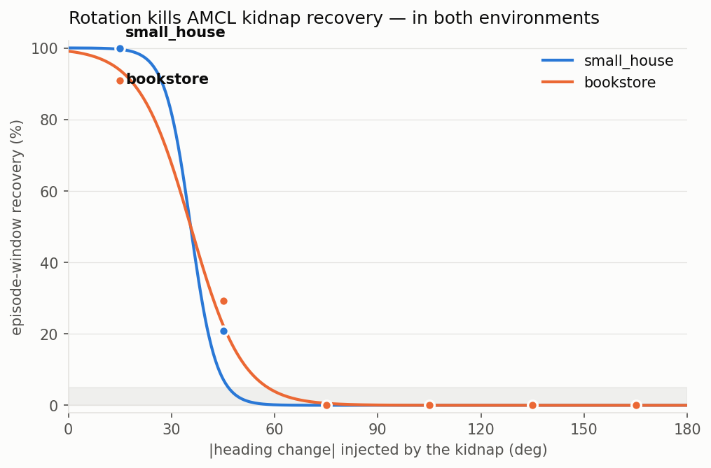
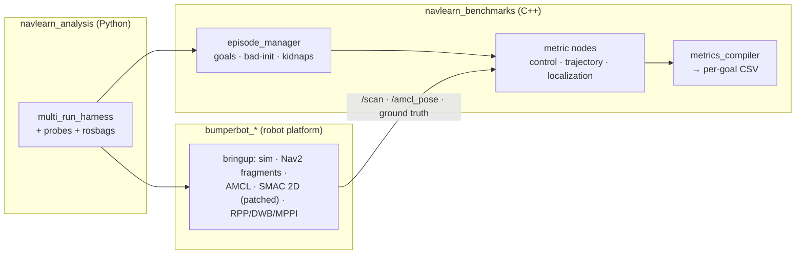
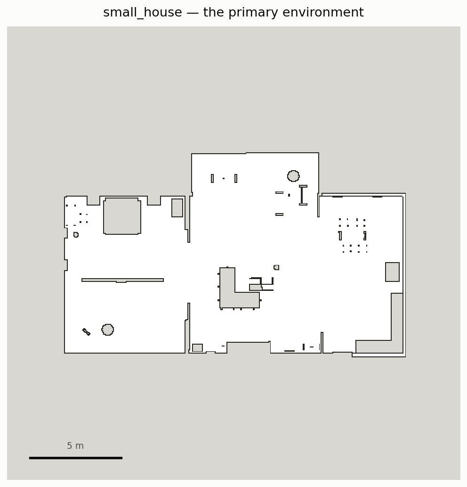
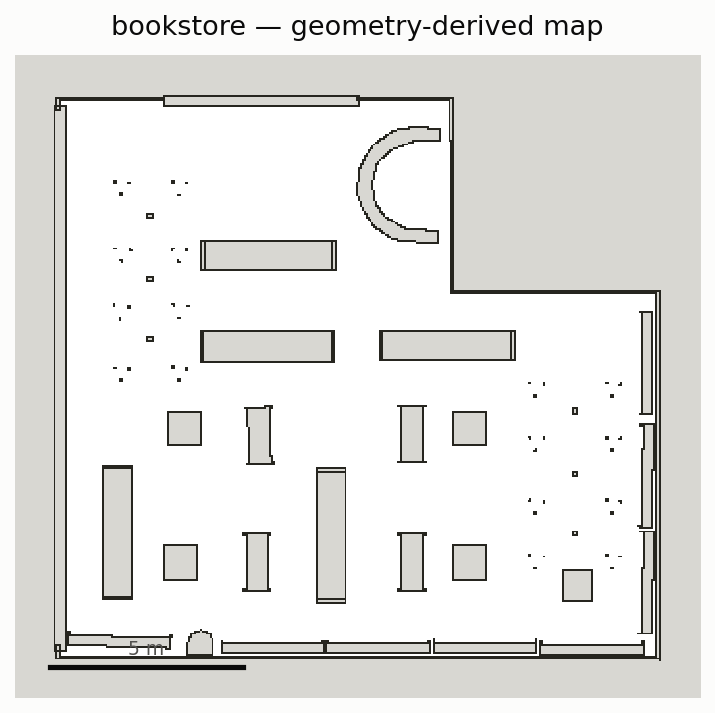
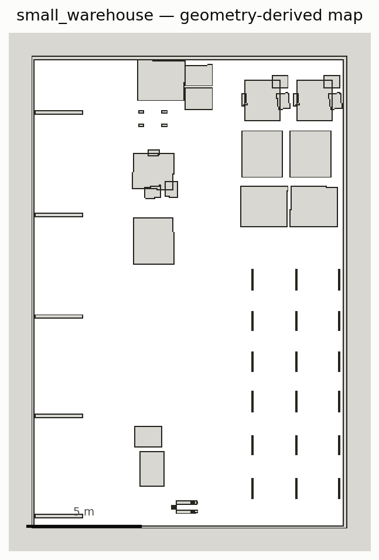

# NavLearn

**A benchmarking framework that catches a navigation stack being confidently wrong.**

NavLearn runs a ROS 2 / Nav2 stack through seeded, perturbed navigation campaigns —
bad initialization, mid-goal kidnaps, heading rotations, sensor starvation — and scores
every goal against simulator ground truth instead of the stack's own opinion of itself.
The gap between those two is the finding: Nav2 reports success based on where the robot
*thinks* it is, and under localization stress the two part ways more often, and more
quietly, than the stack's confidence signals admit.

[](https://github.com/MihirMK17/navlearn/actions/workflows/ci.yml)




*One recorded episode from the campaign dataset: the robot is teleported in place and
rotated 177°. AMCL regains its confidence — but not its heading — and its belief
mirrors reality as the robot drives on. Its covariance reports nothing wrong the entire
time. Regenerate: `ros2 run navlearn_analysis animate_kidnap_recovery` (full command in
the module docstring).*

---

## Findings at a glance

Measured across ~2,070 perturbed goals in two environments (a residential house and a
retail bookstore), all against simulator ground truth, all reproducible from the
committed analysis package. Full statistics are in a paper in preparation.

**1. Rotation, not displacement, is what kills kidnap recovery.**
Displace the robot up to 3 m and AMCL usually finds itself again. Rotate it in place
beyond ~45° and episode-window recovery collapses to a few percent — in both
environments:



*Regenerate: `ros2 run navlearn_analysis plot_yaw_cliff` (full command in the module
docstring).*

**2. The failure is confident-and-wrong, and covariance gives no warning.**
In roughly 80% of those failed recoveries the filter returns to its own pre-kidnap
confidence level with position error of centimetres — and heading error roughly equal
to the injected rotation. The part of the covariance a monitoring system would watch
looks perfect. Measured directly from the recorded bags
(`ros2 run navlearn_analysis rate_mechanism`, `mechanism_by_bin`).

**3. Nav2's reported success diverges from true success under perturbation.**
Episodes end with `NavigateToPose` SUCCEEDED while ground truth says the robot is not
within tolerance of the goal — and the divergence is largest exactly where the
perturbation is small enough to leave the stack confident
(`ros2 run navlearn_analysis analyze_curve_campaign`).

**4. A starved sensor recovers *better* — for a bad reason.**
Cutting LiDAR from 10 Hz to 1 Hz *improved* kidnap recovery in two of three
controllers. Mechanism, confirmed without exclusion bias: at 10 Hz the filter resamples
on rapid, near-identical scans, collapses onto the wrong pose within ~0.1 s at ~1 m
error, and reports confidence; at 1 Hz it stays honestly unsure until the evidence
catches up.

---

## Architecture


```mermaid
flowchart LR
    subgraph campaign["navlearn_analysis (Python)"]
        H["multi_run_harness\n+ probes + rosbags"]
    end
    subgraph robot["bumperbot_* (robot platform)"]
        B["bringup: sim · Nav2 fragments ·\nAMCL · SMAC 2D (patched) · RPP/DWB/MPPI"]
    end
    subgraph instrument["navlearn_benchmarks (C++)"]
        EM["episode_manager\ngoals · bad-init · kidnaps"]
        MET["metric nodes\ncontrol · trajectory · localization"]
        MC["metrics_compiler\n→ per-goal CSV"]
    end
    H --> B
    H --> EM
    EM --> MET --> MC
    B -->|"/scan · /amcl_pose · ground truth"| MET
```

Layers, one sentence each:

- **`src/bumperbot/`** — the robot platform: description, controllers, localization,
  and the Nav2 configuration as composable fragments where cross-arm parity lives in
  exactly one file.
- **`src/navlearn/`** — the framework: `navlearn_msgs` (the typed contract),
  `navlearn_benchmarks` (every runtime C++ node), `navlearn_analysis` (harness, probes,
  claim analyses, figure generators — one installed Python package), `navlearn_assets`
  (campaign worlds and maps with recorded provenance).
- **`src/third_party/`** — vendored `nav2_smac_planner` with an off-map-pose crash fix,
  under a documented vendoring contract.

The runtime contract — topic names, message types, node names — is **frozen**: the
collected dataset serializes it into rosbags, so renames are comparability breaks by
definition. The full diagram, the contract table, and the design-decision log live in
[docs/architecture.md](docs/architecture.md).

## Repository map

```
src/
  bumperbot/            robot platform (10 packages; BumperBot course lineage)
  navlearn/
    navlearn_msgs/        interfaces — the frozen data contract
    navlearn_benchmarks/  runtime C++: episode manager, metric nodes, kidnap bridge
    navlearn_analysis/    harness · probes · claim analyses · figures · campaign shell
    navlearn_assets/      bookstore world + models, campaign maps, provenance
  third_party/          vendored nav2_smac_planner (patched)
docs/                   architecture, experiment notes
media/                  README media — everything under generated/ regenerates from data
```

Every package carries its own README with its contract and its known gaps.

## Quick start

Requirements: Ubuntu 22.04, ROS 2 Humble, Gazebo Fortress (`ign gazebo`), Nav2.

```bash
git clone https://github.com/MihirMK17/navlearn.git && cd navlearn
rosdep install --from-paths src --ignore-src -r -y
colcon build --symlink-install
source install/setup.bash

# Simulated robot + Nav2, ready for goals
ros2 launch bumperbot_bringup simulated_robot.launch.py \
    world_name:=small_house controller:=rpp planner:=smac2d localizer:=amcl_tuned
```

Run a small benchmark — one episode, five seeded goals, a kidnap per goal — through the
same path every campaign uses:

```bash
source src/navlearn/navlearn_analysis/scripts/cell_runner.sh
NAVLEARN_WORLD=small_house run_cell results/smoke \
    --episodes 1 --goals 5 --seed 42 --perturbation ttr \
    -- controller:=rpp planner:=smac2d localizer:=amcl_tuned
```

`run_cell` refuses a dirty environment, waits for the stack to be genuinely active,
runs the harness with probes and a rosbag, and tears down with confirmation. Results
land in `results/smoke/`: a per-goal metrics CSV, a long-format localization CSV,
delivered-rate and compute JSONs, the stack-provenance record, and the bag.

## Running a campaign

Campaigns are shell drivers over `run_cell` — see
`src/navlearn/navlearn_analysis/scripts/leg7_bookstore_campaign.sh` for the full
pattern: preflight gates that refuse to start on the wrong binary, the wrong map, or
missing GPU offload; per-run delivered-rate verification; an independent detached
watchdog (`campaign_watchdog.sh`) so an overnight hang alerts instead of burning the
night.

Two design rules do most of the work:

- **Seeding** — every `(campaign, run, goal)` draws its goal and its perturbation from
  splitmix64: unique per goal, identical across controller arms, so comparisons are
  paired by construction.
- **Provenance** — the bringup writes exactly which configuration fragments it
  composed; the harness refuses to run without that record and stamps every run with
  the git SHA.

## Reproducing the analyses

Every number comes from a committed, tested entry point that reads the recorded CSVs
and bags:

| entry point | what it computes |
|---|---|
| `analyze_curve_campaign` | true / false / reported success and recovery vs perturbation magnitude |
| `recompute_ttr_from_bags` | episode-window recovery recomputed offline from the bags |
| `run_yaw_claim` | the rotation-cliff logistic model comparison |
| `compare_yaw_slopes` | cross-environment slope comparison with confidence intervals |
| `rate_mechanism` / `mechanism_by_bin` | position and heading error at the moment confidence returns |
| `run_claim2_models` | landing-site vs distance nested-model comparison |
| `validate_nav2_stack` | the configuration parity gate (also runs as a test) |
| `world_to_map` | occupancy map generated from a world's collision geometry |

All invoked as `ros2 run navlearn_analysis <name>`. Reruns on the recorded campaign
CSVs are byte-identical — that property is checked whenever the package is
restructured.

## The dataset

~2,070 perturbed goals across seven experiment legs: continuous perturbation curves for
bad-init and kidnap (magnitudes drawn per goal, not levels), a heading-rotation curve,
an AMCL measurement-model ablation, sensor starvation at four rates, clean baselines,
and a second-environment replication. Per goal: the metrics row, the localization
series, and a rosbag of the frozen topic set. Raw data stays out of git; these are the
environments it was collected in:

| | | |
|---|---|---|
|  |  |  |

The `*_geom` maps are generated from each world's collision geometry at the robot's
LiDAR height — no SLAM, no pose drift, so map error is not a confound in any
localization number (`navlearn_assets/maps/*/PROVENANCE.md`).

## The robot


BumperBot is a differential-drive robot with an RPLidar A1, based on Antonio Brandi's
[BumperBot](https://github.com/AntoBrandi/Bumper-Bot) course platform (Apache-2.0) —
real-robot firmware included, though every result here is simulation. NavLearn is
built robot-agnostic on top: point the bringup at your description, keep the topic
contract, and the instrument layer neither knows nor cares what it is measuring.

<br clear="right"/>

## Quality gates

- CI: black + flake8 over `src/navlearn/`, full workspace build, `colcon test` over the
  navlearn packages — ~420 test cases, from gtest units on the perturbation samplers to
  contract tests that publish real messages through the compiler and inspect the
  resulting CSV row.
- The nav2 configuration parity gate fails the build if controller arms drift apart on
  anything but the declared ablation variable.
- Test discovery is structural: the analysis package's tests are found wholesale by
  colcon, so a test file cannot be silently unregistered.

## Citation & license

Apache-2.0 (see [LICENSE](LICENSE)). If you use NavLearn in research, please cite via
[CITATION.cff](CITATION.cff). Campaign worlds and models are vendored from
aws-robomaker (MIT-0, archived upstream 2026-07-21).

Maintainer: [Mihir Kulkarni](https://www.linkedin.com/in/mihir-kulkarni-3670b3148/) ·
mihir.kulkarni17@gmail.com
