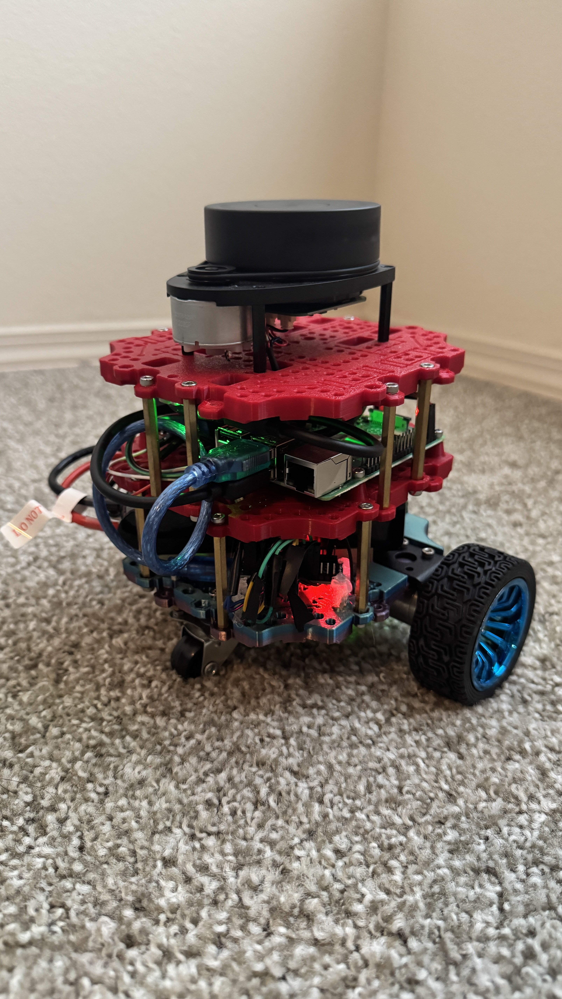
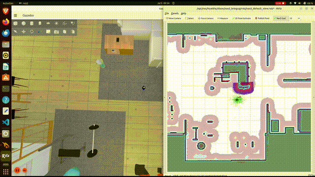
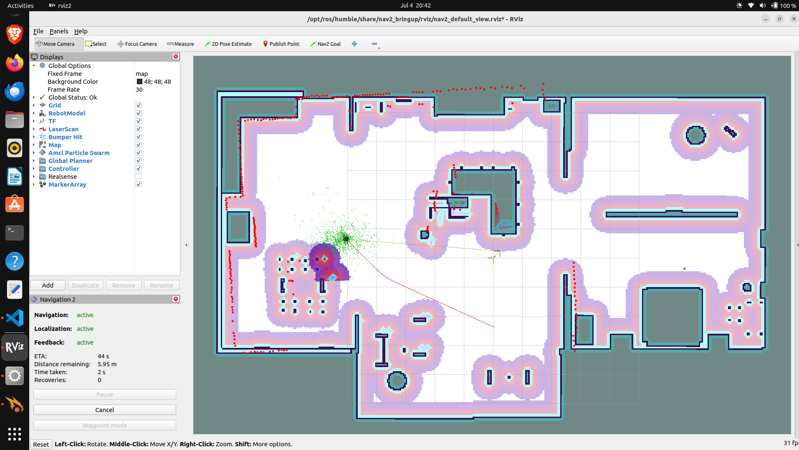
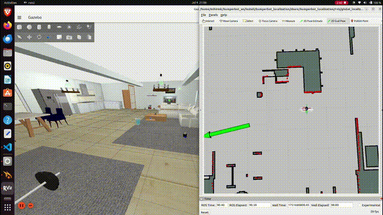
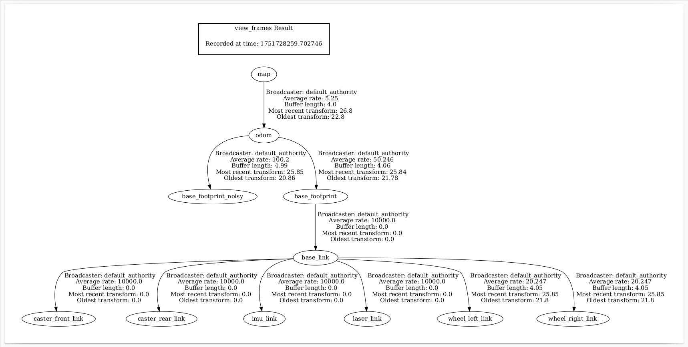

# NavLearn: 

_Reproducible Nav2-based navigation and benchmarking stack for real and simulated robots_


NavLearn is a modular ROS 2 project for building and **benchmarking** autonomous mobile robot navigation pipelines across Gazebo and NVIDIA Isaac Sim, and mirroring them on real robots. It bundles SLAM, localization, planning, control, and a reproducible Nav2 benchmarking harness with planned extensions for reinforcement learning and multi-robot systems.

---

## 📸 Project Highlights
<p align="center">
  
</p>

---

## Overview / Motivation

Nav2 is a powerful, production-grade navigation framework, but turning it into a **reliable, well-tuned stack for your own robot** is still painful. You juggle hundreds of parameters, multiple planners/controllers, different simulators, and a real robot — and there’s no single, repeatable way to say “this configuration is better than that one.”

NavLearn is meant to be that missing piece: a single ROS 2 repo that couples a solid Nav2 stack with a **reproducible benchmarking workflow** for both simulation and real robots.

It provides:

- A **reference Nav2-based navigation stack** (SLAM/localization, planning, control) wired for a Turtlebot-style differential-drive robot.
- A **sim-first workflow** that keeps Gazebo and NVIDIA Isaac Sim setups aligned so you can iterate quickly before touching hardware.
- A **benchmarking harness** that drives scripted navigation goals, records per-goal metrics, and exports CSV/JSON summaries for comparing parameter sets, maps, and robots.
- A foundation for **future work**: reinforcement-learning policies on top of Nav2, multi-robot navigation experiments, and safety layers.

The goal is not “yet another navigation demo,” but a **repeatable way to answer** questions like:

- Did this controller or planner change actually improve navigation performance?
- How does a given Nav2 configuration behave on a simple 1 m square test map versus a cluttered apartment layout?
- How close is my real-robot behavior to what I see in Isaac Sim?

If you care about moving from “it kind of navigates” to “I can quantify and iterate on navigation performance,” NavLearn is the stack and tooling this repo provides.

---

## Key Features

- **End-to-end Nav2 stack, wired and tuned**
  - SLAM / mapping, localization, planning, and control set up for a Turtlebot-style differential-drive robot.
  - Designed so you can swap maps and robots without rewriting the whole launch zoo.

- **Simulation-first workflow (Gazebo / NVIDIA Isaac Sim)**
  - Matching Nav2 configuration across Gazebo and Isaac Sim so you can debug behavior in sim before touching hardware.
  - Same navigation pipeline, different backends: helps you catch modeling and tuning issues early.

- **Real-robot mirroring**
  - Launch files and configs intended to mirror the simulation stack on a real robot.
  - Lets you take a Nav2 config from “works in sim” to “actually runs on wheels” instead of stopping at RViz demos.

- **Reproducible benchmarking harness**
  - Scripted navigation goals (random or predefined) driven through NavigateToPose.
  - Per-goal metrics (success/failure, timing, path-level metrics, control metrics) logged to CSV and JSON.
  - Multi-run harness + aggregator to compare parameter sets, maps, or robots across batches of runs.

- **Config-first, ROS 2 native design**
  - All major behaviors controlled through ROS 2 parameters and YAML (no magic constants buried in code).
  - Clean separation between bringup, navigation, and benchmarking packages.

- **Built to be extended**
  - Room to plug in reinforcement-learning policies on top of Nav2, experiment with multi-robot scenarios, and add new metrics without rewriting the core stack.
  - CI on GitHub Actions to keep the project building and testable as it grows.
  
---

<<<<<<< HEAD
## Quickstart (TL;DR)
=======
- `navlearn_benchmarks`: C++ nodes that compute and aggregate metrics:
  - `episode_manager` – orchestrates episodes, sends goals, tracks start/end.
  - `trajectory_metric` – path length and basic trajectory stats.
  - `control_metric` – logs `/cmd_vel` for control statistics.
  - `metrics_compiler` – writes CSV / JSON reports.
  
### Episode Manager
Role: 
- Loads navigation goals and sends them to the Robot sequentially
- Tracks episode state, navigation time, start pose, goal pose (and collisions --> planned) for each goal
- Publishes them as EpisodeEvent messages
- Accuracy in goal_xy and goal_yaw is decided by controller_server (0.25m and 0.25 rad/s)
- Accuracy in path length measurements is decided by trajectory metric node's parameters

Configurations: EpisodeManger has the ability to use two goal sources - fixed or randomized as selected by changing the goal_source pararmeter
```bash
goal_source: static
```
Uses YAML defined goals (cannonical 1m demo). The X, Y and Yaw coordinates of the goals configured need to match in size

```bash
- goal_source: map_random
```
Samples `goals_num` size of random free cells from `/map`. Only needs `goals_num` parameter defined

>>>>>>> 8598964 (EpisodeManager config information)

### 0. Prerequisites

- Ubuntu 22.04 with **ROS 2 Humble**
- **Nav2** installed (e.g. `sudo apt install ros-humble-nav2-bringup`)
- **Gazebo** (Fortress/Garden) and the **Bumperbot** stack available in your workspace  
  (from the Learn-By-Doing courses by Antonio Brandi / `bumperbot_bringup` package)
- **Isaac Sim 4.5.0*** installed (refer offcial Isaac Sim documentation)
- A working ROS 2 workspace (colcon)  

> The examples below assume a Bumperbot / Turtlebot3 Burger-style differential-drive robot. Adapting to other robots is covered later.

---

### 1. Clone and build

```bash
mkdir -p ~/navlearn_ws/src
cd ~/navlearn_ws/src

# Clone NavLearn
git clone https://github.com/MihirMK17/navlearn.git

cd ..
rosdep install --from-paths src --ignore-src -r -y
colcon build --symlink-install
source install/setup.bash
```

### 2. Simulation + Nav2 (Isaac Sim + Turtlebot3 Burger)
Terminal 1 - Isaac Sim
```
cd ~IsaacSim/
./isaac-sim.sh
```
This will open the Isaac Sim GUI. To use the pre-configured world and robot, open the `navlearn_test.usd` file in the GUI. Upon opening the USD file, the scene will have a small warehouse world, a Turtlebot3 Burger differential-drive robot, Action Graphs for Odometry, Control, TF and Lidar and the physics engine configured. If you see an error message for the robot prim path, change the robot prim path under a suitable directory

To start the simulation, click on `Play` button. In another terminal start the robot localizaton, map and the navigtaion

Terminal 2
```
cd ~navlearn_ws/

ros2 launch bumperbot_localization global_localization.launch.py
```

Terminal 3s
```
cd ~navlearn_ws/

ros2 launch bumperbot_navigation navigation.launch.py
```
This launches the Turtlebot3 Burger a small warehouse map and starts the Nav2-based navigation stack used by NavLearn (planner, controller, costmaps, BT, etc). 

You should be able to send Nav2 goals from RViz and see the robot navigate.

### 3. Bring up simulation + Nav2 (Gazebo + Bumperbot)
Terminal 1 - Gazebo + Robot Bring up
```
cd ~/navlearn_ws
source install/setup.bash

ros2 launch bumperbot_bringup simulated_robot.launch.py world_name:=small_house
```
This launches the Bumperbot robot in a small house Gazebo world and starts the Nav2-based navigation stack used by NavLearn (planner, controller, costmaps, BT, etc). 

You should be able to send Nav2 goals from RViz and see the robot navigate.

### 4. Run a single NavLearn benchmark run
With the sim and Nav2 stack running
```
cd ~/navlearn_ws
source install/setup.bash

ros2 launch navlearn_benchmarks benchmarks.launch.py goal_nums:=4 goal_source:=map_random
```
This will:
- Sample 4 random navigation goals on the current map
- Drive them through `NavigateToPose`
- Record per-goal metrics and a per-run JSON summary under `benchmark_reports/` (default path; details in the *Usage* section)

The full pipeline should now be running:
Gazebo world / Isaac Sim world --> Bumperbot / Turtlebot3 Burger --> Nav2 Stack --> NavLearn benchmarking harness --> CSV / JSON metrics

---

## Usage

Assuming the following is already done
- Built the workspace and sourced it (`source install/setup.bash`)
- Got a robot + Nav2 stack running (Bumperbot, Gazebo / Isaac Sim, or real robot)

### 1. Navigation / Bringup Workflows

#### 1.1 Gazebo + Bumperbot (recommended starting point)
1. Start Gazebo + Bumperbot bringup
```
ros2 launch bumperbot_bringup simulated_robot.launch.py world_name:=small_house
```

2. Verify in RViz that 
- TF tree is stable (`map --> odom --> base_link --> laser ...`)
- You can send a normal Nav2 goal and the robot movees

Once that's true, the NavLearn's benchmarking harness is ready to be plugged on top.

#### 1.2 Isaac Sim + Turtlebot3 Burger + Nav2
1. Start Isaac Sim 
```
cd ~IsaacSim/
./isaac-sim.sh
```

2. Open `navlearn_test.usd` file in the Isaac Sim Gui. Click on `Play` to start the Simulation. Verify that
- Robot doesn't fall through the floor or hovers above the Ground Plane
- In RViz, the TF tree is intact and you are able to see the RTX Lidar configured in the Sim
- You are able to teleop the robot with the keyboard by running the teleop twist keyboard ROS2 package like below
```
ros2 run teleop_twist_keyboard teleop_twist_keyboard
```

3. Start the localization and navigation packages for the robot by launching the respective launch file like below
```
ros2 launch bumperbot_localization global_localization.launch.py
```

```
ros2 launch bumperbot_navigation navigation.launch.py
```

Once that's done, the NavLearn's benchmarking harness is ready to be plugged on top.

### 2. Benchmarking Workflows
This benchmarking stack is in:
- `navlearn_msgs`: interface types (ControlMetric, TrajectoryMetric, ControlMetric, EpisodeEvent)
- `navlearn_benchmarks`: C++ nodes and Python tooling
	- `episode_manager`
	- `trajectory_metric`
	- `control_metric`
	- `metrics_compiler`
	- `srcipts/multi_run_harness.py`
	- `srcipts/aggregate_runs.py`

#### 2.1 Build the benchmarking stack (optional)
Build the whole workspace or only the navlearn_benchmarks package for just benchmarking pieces
```
cd ~/navlearn_ws
colcon build --packages-select navlearn_msgs navlearn_benchmarks
source install/setup.bash
```

#### 2.2 Single-run benchmark
With Bumperbot + Nav2 already running (sim or real)

```
cd ~/navlearn_ws
source install/setup.bash

ros2 launch navlearn_benchmarks benchmarks.launch.py
```

By default this will:
- Use the configs in `src/navlearn_benchmarks/config/`:
	- `episode_manager_1mSquare.yaml`
	- `trajectory_metric.yaml`
	- `control_metric.yaml`
	- `metrics_compiler.yaml`
- Run the cannonical 1m Square benchmark (if `episode_manager_1mSquare.yaml` is selected)
- Log:
	- Per-goal metrics --> `benchmark_reports/navlearn_metrics.csv`
	- Per-run summary --> `benchmark_reports/navlearn_run_report.json`

This can be treated as the "sanity-check" benchmark; if this doesn't work, the Nav2 / TF / Robot setup might be broken.

#### 2.3 Choosing goal sources (static vs random)
The `episode_manager` node controls which navigation goals are sent. It has a key parameter:
- `goal_source` – one of:
	- `static`: uses a fixed set of goals from a YAML file (canonical 1 m square, hand-picked poses, etc.)
	- `map_random`: sample random free-cell goals from the current /map

High-level behavior:
```
# Example (inside episode_manager_*.yaml)

episode_manager:
  ros__parameters:
    goal_source: static         # or "map_random"
    goals_num: 4                # used when goal_source == "map_random"
    # For static:
    goal_x: [0.5, 0.5, -0.5, -0.5]
    goal_y: [0.5, -0.5, -0.5, 0.5]
    goal_yaw: [0.0, 1.57, 3.14, -1.57]
```
- `goal_source: static`
	- Uses YAML-defined arrays of `goal_x', `goal_y', `goal_yaw'
	- Arrays must be the same length (one entry per goal)
- `goal_source: map_random`
	- Ignores explicit coordinates
	- Samples `goals_num` random free cells from `/map` and uses those as goal positions\

To switch between them, launch the `benchmark.launch.py` with the following launch arguments:
- `episode_manager_config:=episode_manager_1mSquare.yaml` + `goal_source:=static` --> For pre-defined goals. Change the `episode_manager_config` argument with the YAML file with the required changes
-  `goal_source:=map_random` + `goals_num:=4` --> For random goals

#### 2.4 Multi-run harness (batch experiments)
For running many benchmarks back-to-back (e.g., different parameter sets, goal counts, or maps), use:
```
cd ~/navlearn_ws
source install/setup.bash

python3 src/navlearn_benchmarks/scripts/multi_run_harness.py
```

This harness script is designed to:
- Define a list of runs (different configs, maps, or goal counts) in the script itself
- For each run:
	- Call the `navlearn_benchmarks` launch file with the appropriate parameters
	- Save that run's output into a separate directory under:
	```
	src/navlearn_benchmarks/benchmark_reports/runs/
	run_0001/
	navlearn_metrics.csv
	navlearn_run_report.json
	run_0002/
	```
To customize the experiments to run:
- Open `scripts/multi_run_harness.py`
- Edit the run definitions at the top (maps, `goal_source`, `goals_nums`, `episode_nums`, etc)
- Re-run the script

This is the tool to use for actual sweeps, not one-off runs.

#### 2.5 Aggregating runs (compare experiments)
After running multiple benchmarks, the runs are saved under `benchmark_reports/runs`, they can be aggregate. To do so follow below steps
```
cd ~/navlearn_ws
source install/setup.bash

python3 src/navlearn_benchmarks/scripts/aggregate_runs.py
```

Typical behavior:
- Scans `benchmark_reports/runs/**/navlearn_run_report.json`
- Builds a table with one row per run, including metrics like:
	- number of goals
	success rate
	mean/median navigation time
	mean path length
- Prints that table to the terminal in a readable format.
- Optionally writes a summary CSV (e.g. `benchmark_reports/navlearn_runs_summary.csv`) you can open in a notebook or spreadsheet.

<<<<<<< HEAD
This script can be used to compare the configuration, map, robot, etc across multiple runs
=======
Goal Success
A goal is considered successful if the robot reaches inside Nav2’s goal tolerances:

Position within xy_tolerance

Orientation within yaw_tolerance

Time-to-Goal

```bash
t_goal = t_goal_reached − t_goal_sent
```

Measured per episode (per goal sequence if multiple goals are chained).

- Path Length: Sum of Euclidean distances between consecutive robot poses along the executed trajectory, as estimated by odometry/localization.

- Collisions: Number of collision events detected in an episode.

- Control Metrics: Statistics of the control commands (`/cmd_vel`):
	Mean / max linear velocity (`|v|`)
	Mean / max angular velocity (`|ω|`)

Potentially extendable to tracking error if reference vs. executed trajectories are logged.

The framework is designed to be extendable—add more metrics as required.
>>>>>>> 8598964 (EpisodeManager config information)

---

## Metrics & Output Format

NavLearn’s benchmarking stack produces two main artifacts per run:
- A **per-goal CSV** (`navlearn_metrics*.csv`) – one row per navigation goal.
- A **per-run JSON summary** (`navlearn_run_report*.json`) – aggregates across all goals in that run.

When `multi_run_harness.py` is used, these files are created under:
```
~/navlearn_ws/src/navlearn_benchmarks/benchmark_reports/
	navlearn_metrics.csv				# default single-run CSV
	navlearn_run_report.json			# default single-run JSON
	runs/
		navlearn_metrics_run_0001_*.csv       	# batched runs
		navlearn_run_report_run_0001_*.json
		navlearn_metrics_run_0002_*.csv
		navlearn_run_report_run_0002_*.json
```

### 1. Per-goal CSV schema (`navlearn_metrics*.csv)
Each row = one navigation goal. The header is written once, the first time a complete episode (goal) is seen.
| Column                        | Units           | Description                                                                                                                        |
| ----------------------------- | --------------- | ---------------------------------------------------------------------------------------------------------------------------------- |
| `Goal_ID`                     | –               | Stringified UUID for the goal (`EpisodeEvent.goal_id`). Unique per goal. 		                                               |
| `Reference Frame`             | –               | Frame used for poses; currently hard-coded to `"map"`. 		                                                               |
| `Start Pose_X (m)`            | m               | Robot x-position at goal **start**, in `map` frame. 	                                                                       |
| `Start Pose_Y (m)`            | m               | Robot y-position at goal start.                                                                                                    |
| `Start Pose_Yaw (deg)`        | deg             | Robot yaw (heading) at start, converted from quaternion to degrees.                                                                |
| `Goal Pose_X (m)`             | m               | Target goal x-position in `map` frame. 		                                                                               |
| `Goal Pose_Y (m)`             | m               | Target goal y-position.                                                                                                            |
| `Goal Pose_Yaw (deg)`         | deg             | Target goal yaw, in degrees.                                                                                                       |
| `Goal Result Code`            | –               | Numeric result from `EpisodeEvent.result`: `0=NA`, `1=SUCCEEDED`, `2=FAILED`, `3=CANCELED`. 	                               |
| `Goal Result`                 | –               | Human-readable result string: `SUCCEEDED`, `FAILED`, `CANCELED`, `NA`, or `UNKNOWN`.	                                       |
| `Success Count`               | –               | Running count of successful goals so far in this run (monotone non-decreasing). 		                                       |
| `Nav Time (sec)`              | s               | Navigation duration for this goal: `nav_time.sec + 1e-9 * nav_time.nanosec`.	                                               |
| `Nav Time Start (sec)`        | s (ROS time)    | Start timestamp of the goal (`stamp_received`) converted to seconds.                                                               |
| `Nav Time End (sec)`          | s (ROS time)    | Termination timestamp (`stamp_terminated`) converted to seconds.                                                                   |
| `Tracking RMS_V (m/s)`        | m/s             | RMS tracking error in **linear velocity** over the episode. Comes from `ControlMetric.tracking_rms_v`. 		               |
| `Tracking RMS_W (rad/s)`      | rad/s           | RMS tracking error in **angular velocity** (`tracking_rms_w`).                                                                     |
| `Saturation Frac_V`           | fraction [0–1]  | Fraction of control samples where linear velocity was saturated. `saturation_frac_v`.                                              |
| `Saturation Frac_W`           | fraction [0–1]  | Fraction of samples where angular velocity was saturated. `saturation_frac_w`.                                                     |
| `Slip Mean`                   | –               | Mean longitudinal slip estimate over the episode (`slip_mean`).                                                                    |
| `Slip Std Deviation`          | –               | Standard deviation of slip (`slip_std`).                                                                                           |
| `Slip 95_Percentile`          | –               | 95th percentile of |slip| over the episode (`slip_p95`). 		                                                               |
| `Control Energy`              | arbitrary units | Aggregate “control energy” over the episode (`control_energy`), typically sum of squared control commands over time.	       |
| `Control Samples`             | count           | Number of `/cmd_vel` samples aggregated (`samples`).                                                                               |
| `Path Length (m)`             | m               | Total distance traveled in this episode (`TrajectoryMetric.path_length_m`).		                                               |
| `Absolute Path Error RMS (m)` | m               | Placeholder for future ATE RMSE; currently written as `0`.                                                                         |
| `Relative Pose Error (Drift)` | –               | Placeholder for future RPE / drift metrics; currently `0`.                                                                         |
| `Trajectory Samples`          | count           | Number of trajectory samples used (`TrajectoryMetric.samples`). 		                                                       |

Example (truncated) CSV:
```
Goal_ID,Reference Frame,Start Pose_X (m),...,Path Length (m),Absolute Path Error RMS (m),Relative Pose Error (Drift),Trajectory Samples
3f2a5c...,map,0.00,...,4.27,0,0,123
...
```

If required, analysis can be done in a notebook by
- Filtering by `Goal Result` or `Goal Result Code`
- Plotting `Nav Time (sec)` vs `Path Length (m)` vs `Slip` for different configs
- Computing custom success metrics, SPL-like measures, etc

### Per-run JSON schema (`navlearn_run_report*.json)
Every time the `metrics_compiler` node shuts down cleanly, it writes a single JSON summary for that run to `json_path`

Schema (all numeric fields are scalars):
| Key                    | Type    | Description                                               |
| ---------------------- | ------- | --------------------------------------------------------- |
| `goals_total`          | int     | Total number of goals seen in this run.                   |
| `goals_succeeded`      | int     | Count of goals with `RESULT_SUCCEEDED`.                   |
| `goals_failed`         | int     | Count of goals with `RESULT_FAILED`.                      |
| `goals_canceled`       | int     | Count of goals with `RESULT_CANCELED`.                    |
| `nav_time_mean`        | float s | Mean navigation time across all goals in this run.        |
| `total_nav_time`       | float s | Sum of navigation times across all goals.                 |
| `path_length_mean`     | float m | Mean path length across all goals.                        |
| `total_path_traveled`  | float m | Sum of path lengths across all goals.                     |
| `control_energy_mean`  | float   | Mean control energy across all goals.                     |
| `total_control_energy` | float   | Sum of control energies across all goals.                 |
| `csv_path`             | string  | Absolute path to the CSV used for this run. 	       |

Example
```
{
  "goals_total": 4,
  "goals_succeeded": 4,
  "goals_failed": 0,
  "goals_canceled": 0,
  "nav_time_mean": 5.321,
  "total_nav_time": 21.284,
  "path_length_mean": 4.27,
  "total_path_traveled": 17.08,
  "control_energy_mean": 13.5,
  "total_control_energy": 54.0,
  "csv_path": "/path/to/navlearn_ws/src/navlearn_benchmarks/benchmark_reports/navlearn_metrics_run_0001_20251201_120000.csv"
}

```

This is what `aggregate_runs.py` reads when it builds its summary table.


### 3. Aggregate runs summary (`aggregate_runs.py`)
When below `aggregate_runs.py` is run
```
python3 src/navlearn_benchmarks/scripts/aggregate_runs.py
```
the script:
- Looks for `navlearn_run_report_run_*.json` in the `runs/` directory (or a directory you pass as an argument)
- Prints a tab-separated table with:
	- `Run` – filename (`navlearn_run_report_run_0001_*.json`, etc.)
	- `Goals` – `goals_total`
	- `Success` – `goals_succeeded`
	- `Fail` – `goals_failed`
	- `NavTime_mean[s]` – `nav_time_mean`
	- `Path_mean[m]` – `path_length_mean`
	- `CtrlEnergy_mean` – `control_energy_mean`
- Then prints an `ALL_RUNS` row where nav time, path length, and control energy are averaged over all goals across all runs, not just naïve mean-of-means. 

Example (schematic):
```
Run                                   Goals  Success  Fail  NavTime_mean[s]  Path_mean[m]  CtrlEnergy_mean
navlearn_run_report_run_0001_....json 4      4        0     5.32            4.27          13.5
navlearn_run_report_run_0002_....json 4      3        1     6.10            4.85          14.1

ALL_RUNS                              8      7        1     5.71            4.56          13.8
```

---

## Configuration
NavLearn is **config-first**: no need to recompile just to change maps, robots, or metrics.  
Most behavior is controlled through YAML files in:
- `navlearn_benchmarks/config/`
- `bumperbot_bringup/launch/'	`# Through Launch Configurations

Below is how the main pieces fit together and what is typically needed to edit.

### 1. Robot + Nav2 assumptions

NavLearn’s benchmarking harness assumes you already have:
- Frames:
  - `map → odom → base_link → {laser, depth_camera, ...}`
- Topics (or their equivalents, remapped in launch):
  - `/tf`, `/tf_static`
  - `/odom`
  - `/scan` (or `/pointcloud` + a laser plugin)
  - `/cmd_vel`
  - `/map`
- Nav2 action server:
  - `NavigateToPose` available under `/navigate_to_pose`

If any of these differ on the robot, it can be fixed with **remappings** in the bringup or by editing the NavLearn configs.

### 2. Episode Manager (`episode_manager_*.yaml)
Controls **which goals are sent** to Nav2, in what order, and with what timing.

Typical config (simplified):

```yaml

episode_manager:
  ros__parameters:
    dwell_sec: 1.0  # sec
    goal_source: map_random
    goal_poses_x: [1.0, 0.0, 2.0, -1.0, 5.0, 7.0, 8.3, 4.0, -1.0, -2.0, -5.0, -7.8, -6.5, 0.0, 
                   1.0, 0.0, 2.0, -1.0, 5.0, 7.0, 8.3, 4.0, -1.0, -2.0, -5.0, -7.8, -6.5, 0.0,
                   1.0, 0.0, 2.0, -1.0, 5.0, 7.0, 8.3, 4.0, -1.0, -2.0, -5.0, -7.8, -6.5, 0.0,
                   1.0, 0.0, 2.0, -1.0, 5.0, 7.0, 8.3, 4.0, -1.0, -2.0, -5.0, -7.8, -6.5, 0.0]
    goal_poses_y: [0.0, 0.0, 1.0, 3.0, -2.0, -1.0, 1.7, -4.0, -4.0, -1.0, -4.0, -2.75, 0.0, 0.0,
                   0.0, 0.0, 1.0, 3.0, -2.0, -1.0, 1.7, -4.0, -4.0, -1.0, -4.0, -2.75, 0.0, 0.0,
                   0.0, 0.0, 1.0, 3.0, -2.0, -1.0, 1.7, -4.0, -4.0, -1.0, -4.0, -2.75, 0.0, 0.0,
                   0.0, 0.0, 1.0, 3.0, -2.0, -1.0, 1.7, -4.0, -4.0, -1.0, -4.0, -2.75, 0.0, 0.0]
    goal_poses_yaw: [0.0, 90.0, 180.0, 270.0, 0.0, 90.0, 180.0, 270.0, 0.0, 90.0, 180.0, 270.0, 0.0, 90.0,
                     0.0, 90.0, 180.0, 270.0, 0.0, 90.0, 180.0, 270.0, 0.0, 90.0, 180.0, 270.0, 0.0, 90.0,
                     0.0, 90.0, 180.0, 270.0, 0.0, 90.0, 180.0, 270.0, 0.0, 90.0, 180.0, 270.0, 0.0, 90.0,
                     0.0, 90.0, 180.0, 270.0, 0.0, 90.0, 180.0, 270.0, 0.0, 90.0, 180.0, 270.0, 0.0, 90.0]    
    goals_num: 56
    action_server: /navigate_to_pose
    episode_pub_topic: /navlearn/episode_event
    fixed_frame: map
    robot_frame: base_link
```

What matters:
- `goal_source`
	- `static` → uses `goal_x/y/yaw` arrays (same length, one entry per goal)
	- `map_random` → samples `goals_num` random free cells from `/map`

You’ll typically maintain multiple episode_manager YAMLs:
- `episode_manager_1mSquare.yaml` – canonical 1 m square benchmark
- `episode_manager_stressgoals.yaml` – multiple goals with small dwell window between two goals
- `episode_manager_custom.yaml` – your own layout

### 3. Trajectory Metric (`trajectory_metric.yaml)
Samples the robot trajectory and computes path length + trajectory samples.

Representative config:
```yaml

trajectory_metric:
  ros__parameters:
    odom_topic: /bumperbot_controller/odom
    jitter_guard: 0.002
    max_gap_dt: 0.5
    rpe_delta: 1.0

    episode_event_topic: /navlearn/episode_event
    trajectory_metric_topic: /navlearn/trajectory_metric
```

Key ideas:
- Reads pose from `/odom` and accumulates path length in the `map` frame
- Must use consistent frames with the rest of your stack (`map` / `odom` / `base_link`)

### 4. Control Metric (`control_metric.yaml`)
Subscribes to /cmd_vel (and optionally odom/TF) and computes:
- Tracking RMS for linear / angular velocity.
- Saturation fractions.
- Slip statistics.
- Aggregate control “energy.”

Representative config:
```yaml

control_metric:
  ros__parameters:
    controller_topic: /bumperbot_controller/cmd_vel
    wheel_radius: 0.033 # m
    wheel_separation: 0.16  # m
    v_max: 0.25 
    w_max: 1.0
    saturation_tolerance: 0.98
    eps_v: 0.05
    eps_w: 0.05
    buffer_span: 2.0  # sec
    lambda: 0.5

    odom_topic: /bumperbot_controller/odom
    joint_states_topic: /joint_states
    episode_event_topic: /navlearn/episode_event
    control_metric_topic: /navlearn/control_metric

    wheel_left_joint: wheel_left_joint
    wheel_right_joint: wheel_right_joint

```

Key Ideas:
- If `v_max` / `w_max` / `wheel_radius` / `wheel_separation` don’t match your robot’s controller limits, controller metrics are meaningless
- The odometry topic should match the topic on which wheel odometry is published published

### 5. Metrics Compiler (`metrics_compiler.yaml`)
This node fuses episode events + trajectory metrics + control metrics and writes out the CSV + JSON.

Representative config:

```yaml

metrics_compiler:
  ros__parameters:
    csv_path: /home/mihirmk/robot_ws/src/navlearn_benchmarks/benchmark_reports/navlearn_metrics.csv
    json_path: /home/mihirmk/robot_ws/src/navlearn_benchmarks/benchmark_reports/navlearn_run_report.json
    episode_event_topic: /navlearn/episode_event
    control_metric_topic: /navlearn/control_metric
    trajectory_metric_topic: /navlearn/trajectory_metric
```

### 6. Launch-level configuration
The main benchmark launch file (e.g. `launch/benchmarks.launch.py`) typically exposes a few arguments:
- `goal_source` – forwarded to `episode_manager`
- `goals_num` – forwarded to `episode_manager`
- `csv_path` / `json_path` – forwarded to `metrics_compiler`
- `use_sim_time` – syncs all nodes to simulation clock.

Example call overriding defaults:
```
ros2 launch navlearn_benchmarks benchmarks.launch.py \
  goal_source:=map_random \
  goals_num:=10 \
  csv_path:=benchmark_reports/small_house_random10.csv \
  json_path:=benchmark_reports/small_house_random10.json \
  use_sim_time:=true
```

### 7. Adapting to a different robot
To plug in a new robot (as long as it’s Nav2-compatible):
- Make sure your bringup provides:
	- map, odom, base_link, laser frames.
	- The standard topics (/map, /odom, /scan, /cmd_vel).
	- A working NavigateToPose action server.
- Fix any topic / frame name mismatches via:
	- Nav2 config / remaps.
	- NavLearn configs (odom_topic, cmd_vel_topic, world_frame, base_frame, etc.).
- Run the canonical 1 m square benchmark first:
	- If that fails, your robot or Nav2 setup is broken, not NavLearn.

Once that works, you can start swapping maps, changing goal sets, and running multi-run sweeps without touching code.

---

## Cannonical Demos

### 1. SLAM Mapping Demo

> Demonstrates full mapping in an indoor environment.

<p align="center">
  
</p>

---

### 2. Navigation with Static and Dynamic Obstacles

> Shows side-by-side RViz and Gazebo with real-time path replanning.

<p align="center">
  
</p>

---

### 3. Navigation Snapshot

> Local and global costmaps with AMCL localization
<p align="center">
  
</p>

---

### 4. Gazebo Simulation

> Simulated robot running the full navigation stack

<p align="center">
  
</p>

---

### 5. Canonical Benchmark Demo — 1m Square (Isaac Sim)

> The canonical NavLearn benchmark is a robot running repeated 1m square navigation episodes in Isaac Sim while metrics are logged

High-level flow:
- Isaac Sim runs the world and robot with ROS 2 bridge.
- Nav2 runs the navigation stack on the ROS side.
- navlearn_benchmarks nodes run in parallel to log metrics and compile reports.

<p align="centre">
  
</p> 

---

### 6. TF Tree

> Frame visualization after `bumperbot_bringup`



---

## Project Documentation

### 1. Completed

* [x] Real-world SLAM & Navigation setup
* [x] Simulation setup & ROS2 bridge
* [x] Teleop + autonomous navigation
* [x] CI workflow for ROS2 Humble
* [x] Navigation benchmark and metrics

### 2. Common Issues & Fixes

**1. L298N H-Bridge Partial Failure**
Only one motor would work in forward motion due to a damaged internal transistor. Diagnosis was done using joystick teleop commands.

**Fix:** Switched to a reliable driver (e.g., TB6612FNG), added flyback protection, improved ventilation, and verified stall current specs.

**2. HRB 3S Battery Power Drop**
Old battery dropped to 5.04V leading to inconsistent motor behavior and RPi brownout.

**Fix:** Replaced with a rechargeable 3S G-Tech 5000mAh LiPo, ensuring consistent voltage and capacity.

**3. TF Tree Frame Drops / Misalignment**
During SLAM and Navigation, unexpected frame loss occurred.

**Fix:** Verified static\_transform\_publisher configurations, frame\_id consistency in URDF, and launched the correct state\_publisher order.

More fixes and logs documented in [`Project Documentation`](Project%20Documentation.docx)

---

## Coming Soon

* ✅ Calibration of wheel base and motor gains
* 🧠 Reinforcement Learning for local planning
* 🤖 Multi-agent navigation support
* ☁️ Edge-cloud updates for policy deployment
* 📈 More advanced benchmarking metrics and automated test scenarios

---

## Author

* Mihir Kulkarni
* [LinkedIn](https://www.linkedin.com/in/kulkarnimihir17/)
* [mihir.kulkarni17@gmail.com](mailto:mihir.kulkarni17@gmail.com)

---

## License

This project is based on open-source work by Antonio Brandi ([BumperBot](https://github.com/AntoBrandi/Bumper-Bot)) under Apache 2.0 License.
All modifications and extensions in NavLearn are released under the same license.

---

> 🚧 Built for learning. Made for real-world autonomy.

---


