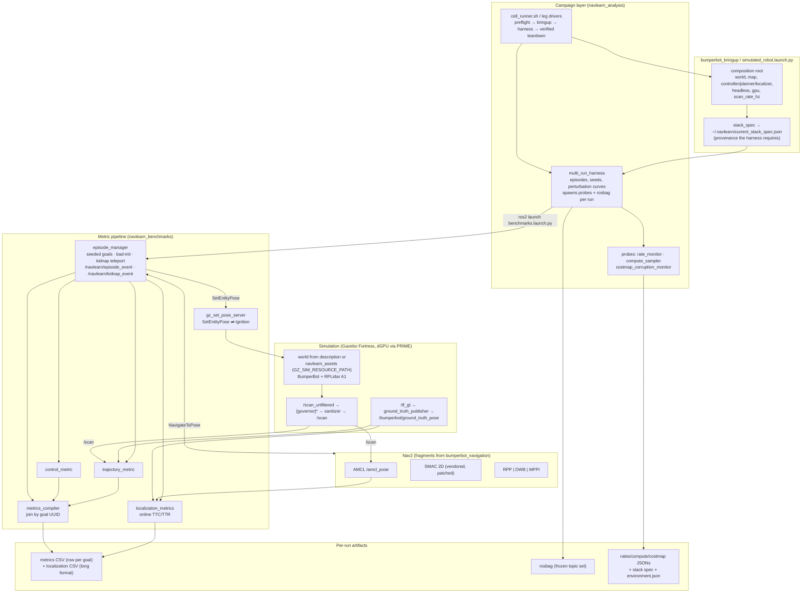

# NavLearn Architecture

How a benchmark run actually flows, from the operator's shell to the per-goal CSV row.

## The full pipeline

\* the scan-rate governor is composed only for sensor-starvation cells.

## The frozen runtime contract

Recorded rosbags and CSVs (~2,070 goals) serialize these names; they are stable across
refactors by policy:

| kind | names |
|---|---|
| topics | `/amcl_pose` · `/bumperbot/ground_truth_pose` · `/navlearn/kidnap_event` · `/navlearn/episode_event` · `/scan` · `/bumperbot_controller/cmd_vel` |
| interfaces | `navlearn_msgs/*` (see that package's README) |
| executables | the pipeline nodes above (teardown kills by process name) |

## Key design decisions

| Decision | Choice | Rationale |
|----------|--------|-----------|
| Config switching | composable YAML fragments, no recompile | parity lives in one `common/` file; arms cannot drift |
| Provenance | stack-spec JSON with live-writer check, git SHA per run | "which configuration produced this number" is always answerable |
| Goal + perturbation draws | splitmix64 from (campaign, run, goal) | unique per goal, identical across controller arms — the precondition for paired statistics |
| Ground truth | Ignition transport (not ros-gz-bridge) | lower latency; also carries the kidnap teleport |
| Perturbation magnitudes | continuous curves, not levels | the sweep is the experiment; no discarded calibration |
| Sensor starvation | decimate the published stream | one variable moves; the simulated sensor stays identical |
| Recovery definition | 0.20 m AND 0.10 rad, 2 s hold | position alone is exactly what the confident-wrong failure fools |
| Analysis | committed, tested package (`navlearn_analysis`) | an analysis that cannot be re-run cannot be defended |
