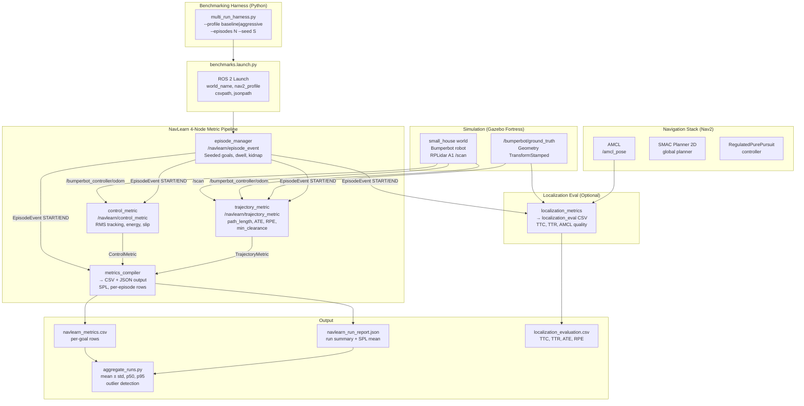

# NavLearn Architecture Diagram

## Full Pipeline (Mermaid)



## navlearn_msgs Data Contract

```
EpisodeEvent (per-goal):
  goal_id, state (START|END), result, nav_time
  start_pose, goal_pose
  recoveries, collision_count, optimal_path_m

ControlMetric (per-goal):
  goal_id, tracking_rms_v, tracking_rms_w
  saturation_frac_v, saturation_frac_w
  slip_mean, slip_std, slip_p95
  control_energy, samples

TrajectoryMetric (per-goal):
  goal_id, path_length_m, duration, samples
  ate_rmse_m, ate_count, rpe_trans_rmse_m, rpe_count
  ref_source, ref_frame
  min_clearance_m
```

## Key Design Decisions

| Decision | Choice | Rationale |
|----------|--------|-----------|
| Config switching | YAML profiles, no recompile | Reproducible A/B comparison |
| Goal generation | Seeded random (map_random) | Identical conditions across runs |
| Output format | CSV (per-goal) + JSON (per-run) | CSV for analysis, JSON for CI checks |
| Ground truth | Ignition transport (not ros-gz-bridge) | Lower latency, Gazebo-native |
| ATE/RPE | Nearest-timestamp matching | Handles async GT + odom rates |
| SPL | optimal_path / max(actual, optimal) | Standard embodied AI metric |
